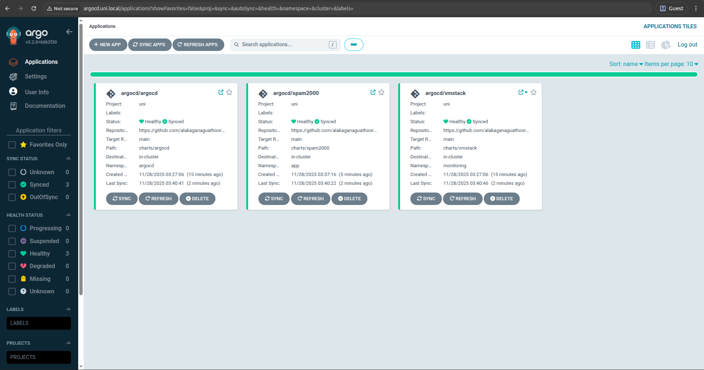
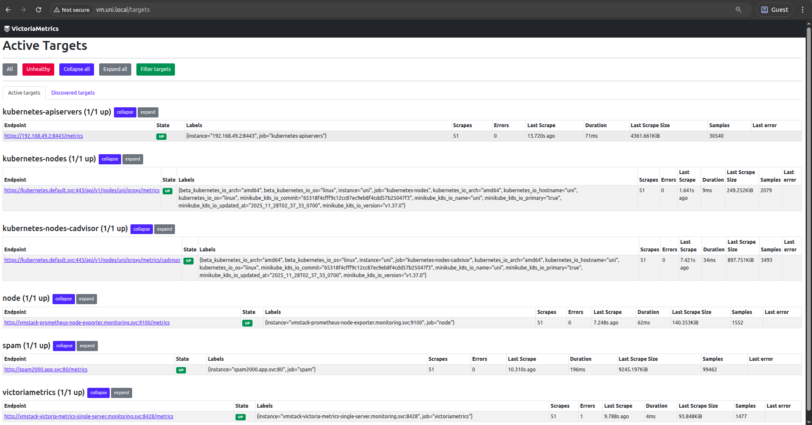
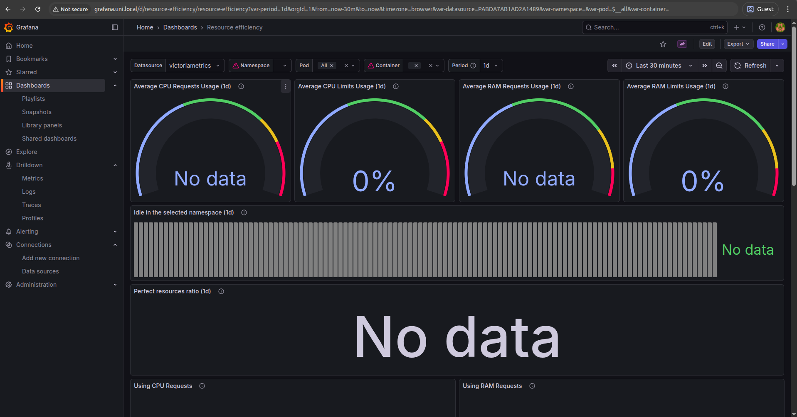
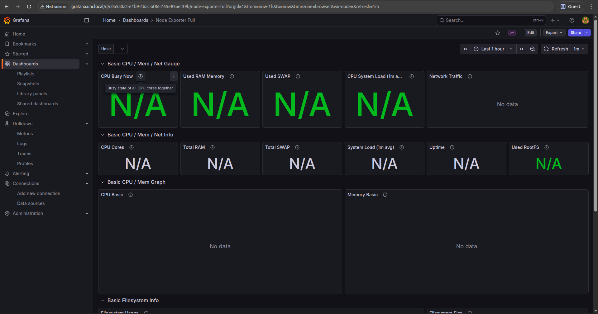
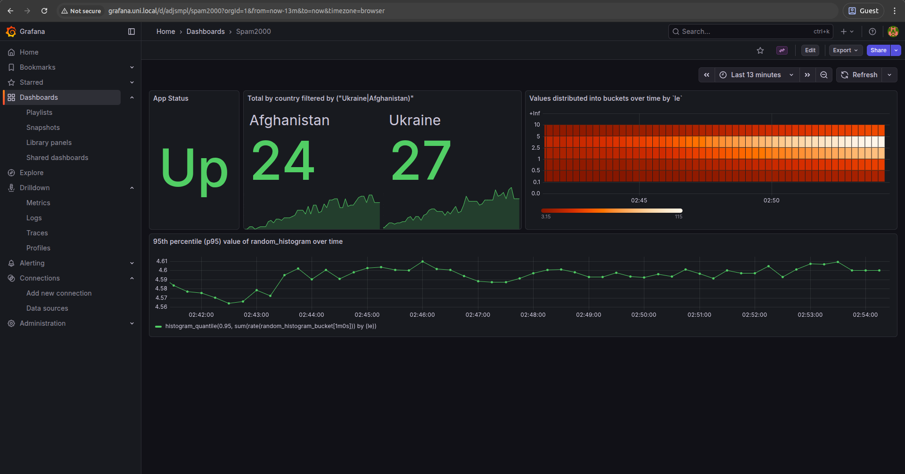
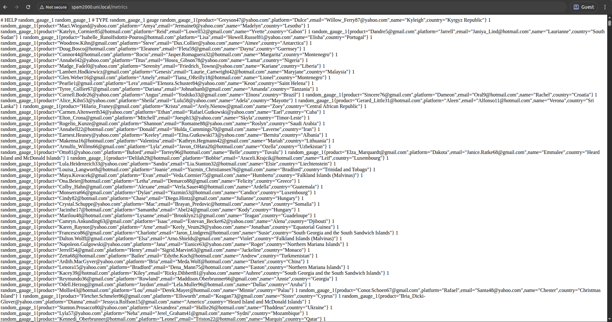

# Objective

This is a test task project for Spam2000 app infrastucture setup. It aim is to test skills of a newcommer in DevOps field.

The `main.sh` will install/clean up few required packages (based on OS: Linux and MacOS.

>MacOS - potentially: I didn't have a chance to test, but required package/s installation has conditional logic for `os` and `arch` in [./scripts/general.sh](./scripts/general.sh)), tools and run services as ArgoCD applications

## Condiderations

:warning: **Warning**: This scripts uses `sudo`:

* to install/clean up required package/s and tools if they are not presented in a system;
* to append/remove hosts in `etc/hosts` file in order to access services via domain names locally.
* minikube was ran on docker driver in rootless mode

:warning: **Warning**: `~/.kube/config` file won't be deleted on cluster deletion to not mess up your existing config (it's commented at [./scripts/resolve_tools.sh:166](./scripts/resolve_tools.sh#L166))

:warning: **Warning**: Installed tools won't be deleted on cluster deletion in order to not mess up your env (it's commented in [main.sh:93](./main.sh#L93))

## Prerequisites

* Docker installed on your machine - as it's used as a container runtime for minikube.

## Usage

To run the project, execute the following command in your terminal:

```bash
./main.sh --action <install|destroy>
```

To access the services, follow this table:

| Service        | URL                             | Username / Password (if applicable)                        |
|----------------|---------------------------------|------------------------------------------------------------|
| ArgoCD         | http://argocd.uni.local         | admin / initial pass would be printed in command terminal  |
| Spam2000 app   | http://spam2000.uni.local       | -                                                          |
| Grafana        | http://grafana.uni.local        | admin / grafana                                            |
| VictoriaMetrics| http://vm.uni.local             | -                                                          |

## What will be installed

Required packages to be installed (if not presented in a system):

* curl

Tools to be installed (if not installed already):

* minikube
* kubectl
* helm
* argocd (via helm)

Apps to be installed and synced in ArgoCD:

* spam2000
* victoria-metrics-single
* kube-state-metrics
* prometheus-node-exporter
* grafana

<table>
    <tr>
      <td>
        
      </td>
      <td>
        
      </td>
    </tr>
</table>

## Notes

1. :-1: Running the `main.sh` in _VSCode terminal_ may lead to issues with file permissions. It is recommended to run the script in a standard terminal:

    ```bash
    sudo: The "no new privileges" flag is set, which prevents sudo from running as root.
    sudo: If sudo is running in a container, you may need to adjust the container configuration to disable the flag.
    ```

2. Cluster will be created with such params in [./scripts/functions.sh:L85-92](./scripts/functions.sh#L85-92):

    ```bash
    --profile="uni" \
    --driver="kvm2" \
    --memory="4096" \
    --cpus="2" \
    --container-runtime="docker" \
    --kubernetes-version="v1.34.0" \
    --addons="ingress"
    ```

3. `vmstack` and `spam2000` applications are in `unknown` state for up to 3-5 min after start - reconcilation happens every 3 min by default. Though, they work fine if sync manually. I assume its due to networking resources readiness state (not all network-related resources ready) after cluster creation.

4. `max_scrape_size` was increased in order to overcome too 'noisy' spam2000 app [./charts/vmstack/values.yaml:35](./charts/vmstack/values.yaml#L35)

5. Few lables were dropped from `random_gauge_1` metric to make it less cardinal in job `spam` [./charts/vmstack/values.yaml:36-39](./charts/vmstack/values.yaml#L36-39)

6. :-1: Didn't manage dashboards imported from Grafana Lab to work - they show no data:

    <table>
        <tr>
          <td>
            
          </td>
          <td>
            
          </td>
        </tr>
    </table>

7. :-1: A custom dashboard for Spam2000 was added as plain json in values file [./charts/vmstack/values.yaml:183-534](./charts/vmstack/values.yaml#L183-534). I didn't manage to import it from a file ([./charts/vmstack/dashboards/spam2000.json](./charts/vmstack/dashboards/spam2000.json)).

    >It is possible to add a dashboard via ConfigMap as well as I know, but I wanted to keep it _GitOps-ish_.

    <table>
        <tr>
          <td>
            
          </td>
          <td>
            
          </td>
        </tr>
    </table>
